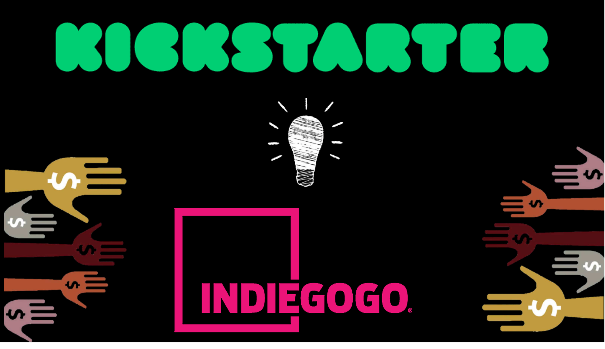
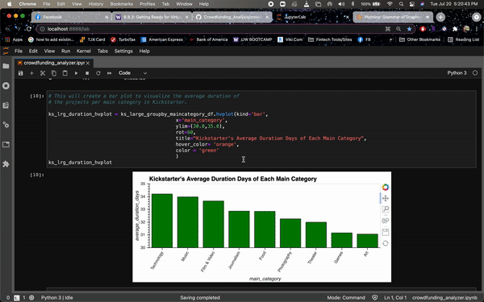

 <p align="center">
  
</p>

<p>&nbsp;</p>

# **Crowdfunding Analysis**
This project attempts to help project creators understand how to market their project on Kickstarter vs Indiegogo or other crowdfunding platforms. The purpose of this tool is to not only give them some advice on platforms but be able to efficiently market their project.

---
## **Technologies**
This project leverages python 3.7.9 with the following packages:
* [pandas](https://pandas.pydata.org/docs/) - For the analysis of crowdfunding data.

* [Jupyter Lab](https://jupyterlab.readthedocs.io/en/stable/) - Used to create and share documents that contain live code, equations, visualizations and narrative text.

* [pathlib](https://docs.python.org/3/library/pathlib.html) - This was used to locate through the directory or file path. Also, it converts a string and converts that supplied string as a PosixPath that can be utilize by other functions such as reading or writing files to csv files.

* [csv](https://docs.python.org/3/library/csv.html) - This was used to be able to read and write csv files easier and that each csv data are separated by a comma.

* [matplotlib](https://matplotlib.org/) - For the visualization of crowdfunding data.

* [numpy](https://numpy.org/install/) - This provides the ability to work with arrays and use different mathematical calculations on arrays.

* [PyVizlot](https://pyviz.org/) -  Python visualization package that provides a single platform for accessing multiple visualization libraries. Two of the libraries are:

  * [plotly.express](https://plotly.com/python/plotly-express/) - For the visualization of crowdfunding data.

  * [hvplot.pandas](https://hvplot.holoviz.org/user_guide/Introduction.html) - For the interactive visualization of the crowdfunding data.

* [Sqlalchemy version 1.3.20](https://anaconda.org/anaconda/sqlalchemy) - This is the Python SQL toolkit and Object Relational Mapper that gives application developers the full power and flexibility of SQL.

* [Voilà](https://github.com/voila-dashboards/voila) - This will allow us to view our Crowdfunding Analysis on the web browser.

* [Wordcloud](https://pypi.org/project/wordcloud/) - This will allow us to create a wordcloud data visualization technique that is used for representing text data. 

* [Plotnine](https://plotnine.readthedocs.io/en/stable/installation.html)- This is a data visualisation package for Python based on the grammar of graphics.

---

## **Installation Guide**
1. On the terminal, under the conda dev environment, install the following packages and dependencies before running the crowdfunding analysis tool:

  ```
    pip install pandas
    pip install plotly
    pip install hvplot
    pip install jupyterlab
    conda install -c pyviz hvplot
    conda list nodejs
    conda list sqlalchemy
    conda install -c conda-forge plotnine
    conda install -c conda-forge wordcloud

  ```
2. To show your crowdfunding analysis tool on your web browser, use `voila` command on the conda dev terminal and while on the correct directory of your crowdfunding analysis application:

    ```voila crowdfunding_analyzer.ipynb```
    * This will pop up on your web browser.

---

## **Examples**



---

## **Usages**
1. Click the crowdfunding_questionary.py and type in the category of your project. So that you can check which platform would work for you better.

2. We use the crowdfunding_analyzer.ipynb to get the comparison on Kickstarter versus Indiegogo. It will show data visualization of each main category.


---


## **Contributors**

### UW FinTech Bootcamp

#### Colin Benjamin [](https://www.linkedin.com/in/colinbenjamin/) &nbsp;&nbsp;&nbsp;| &nbsp;&nbsp;&nbsp; Justine Cho [](https://www.linkedin.com/in/justinecho) &nbsp;&nbsp;&nbsp;| &nbsp;&nbsp;&nbsp; Christopher Henderson [](https://www.linkedin.com/in/chris-henderson123/) &nbsp;&nbsp;&nbsp;| &nbsp;&nbsp;&nbsp; Nathan Patterson [](https://www.linkedin.com/in/natepatterson/) 


---

## **License**

### MIT License

Copyright (c) [2021] [UW Fintech Bootcamp: Colin Benjamin | Justine Cho | Chris Henderson | Nathan Patterson]

Permission is hereby granted, free of charge, to any person obtaining a copy
of this software and associated documentation files (the "Software"), to deal
in the Software without restriction, including without limitation the rights
to use, copy, modify, merge, publish, distribute, sublicense, and/or sell
copies of the Software, and to permit persons to whom the Software is
furnished to do so, subject to the following conditions:

The above copyright notice and this permission notice shall be included in all
copies or substantial portions of the Software.

THE SOFTWARE IS PROVIDED "AS IS", WITHOUT WARRANTY OF ANY KIND, EXPRESS OR
IMPLIED, INCLUDING BUT NOT LIMITED TO THE WARRANTIES OF MERCHANTABILITY,
FITNESS FOR A PARTICULAR PURPOSE AND NONINFRINGEMENT. IN NO EVENT SHALL THE
AUTHORS OR COPYRIGHT HOLDERS BE LIABLE FOR ANY CLAIM, DAMAGES OR OTHER
LIABILITY, WHETHER IN AN ACTION OF CONTRACT, TORT OR OTHERWISE, ARISING FROM,
OUT OF OR IN CONNECTION WITH THE SOFTWARE OR THE USE OR OTHER DEALINGS IN THE
SOFTWARE.